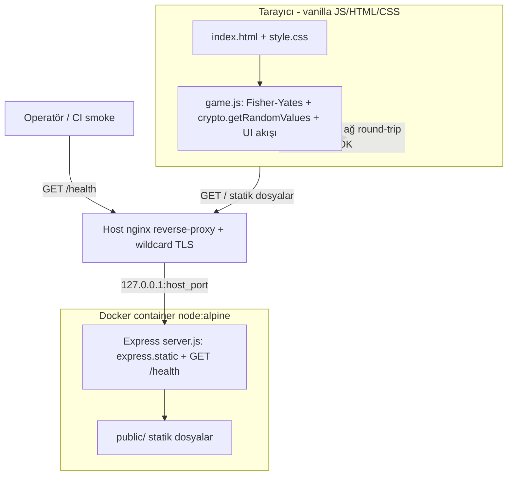

# 05 — Mimari Tasarım: draw-straws

- Tarih: 2026-07-19 | Mod: AUTOPILOT | Profil: LITE

## Bileşen görünümü


## Veri akışı
```mermaid
sequenceDiagram
  participant U as Kullanıcı(lar)
  participant B as Tarayıcı (game.js)
  U->>B: Oyuncu sayısı N gir (2-20)
  B->>B: Doğrula (2..20 tam sayı) → butonu etkinleştir
  U->>B: "Çöpleri Karıştır"
  B->>B: N çöp dizisi (1 kısa, N-1 uzun) + Fisher-Yates (crypto.getRandomValues)
  B->>U: N kapalı çöp, yalnız sıradaki tıklanabilir
  loop Her oyuncu (elden ele)
    U->>B: Sıradaki çöpe tıkla
    B->>U: Kısa/uzun açığa çıkar; sıra sonrakine (idempotent)
  end
  B->>U: Son çöpte kısa çöp sahibini ≤1sn vurgula + aria-live duyuru
  U->>B: "Yeniden Çek" → yeni bağımsız karıştırma
```

## Veri modeli
Kalıcı veri YOK (NFR-3/FR-6). Yalnız istemci belleğinde geçici oyun durumu (sayfa yenilenince kaybolur, hiçbir depolama kullanılmaz):
`Draw = { count: N, straws: [{ index, isShort: bool, revealed: bool }], nextTurn: int, shortIndex: int }`. Sunucu durumsuz; DB/dosya/çerez/localStorage yok.

## Dosya/klasör yapısı (Faz 9 kullanacak)
```
src/
  server.js            # Express: express.static('public') + GET /health → 200 {"status":"ok"}
  public/
    index.html         # semantik markup, aria-live sonuç bölgesi
    style.css          # ≥4.5:1 kontrast, ≥360px responsive
    game.js            # Fisher-Yates (crypto.getRandomValues), giriş doğrulama, elden-ele akış, sonuç vurgusu
tests/
  shuffle.test.js      # dağılım testi: 1000 sim, her pozisyon 1/N ±%2 (FR-2/KPI-2)
  health.test.js       # GET /health = 200 {"status":"ok"} (NFR-8)
Dockerfile             # node:alpine, npm ci --omit=dev (yalnız express), Faz 12
package.json           # tek runtime dep: express; scripts: start/test
```

## Teknoloji seçimleri
| Katman | Seçim | Alternatifler | DL referansı |
|--------|-------|---------------|--------------|
| Sunucu | Node.js LTS + Express (statik + /health) | salt nginx, SSR framework | DL-04-001 |
| İstemci | Vanilla JS + HTML + CSS (framework yok) | React/Svelte | DL-04-001 |
| Rastgelelik | `crypto.getRandomValues` + Fisher-Yates | `Math.random` | DL-05-001 |
| Paketleme | Docker `node:alpine`, `npm ci --omit=dev` | slim/distroless | DL-04-001 |
| Deploy | SSH-push → host nginx `127.0.0.1:host_port` + wildcard TLS | traefik | DL-05-001 |

## NFR ↔ Mimari eşlemesi (kalite kapısı kanıtı)
| NFR | Mimarideki somut karşılığı |
|-----|-----------------------------|
| NFR-1 (≤1sn vurgu) | Sonuç hesabı istemcide, ağ round-trip yok; DOM güncellemesi tek frame — veri akışı son adımı |
| NFR-2 (≤200KB) | Framework yok; yalnız index.html+style.css+game.js (vanilla, ~10-30KB) |
| NFR-3 (durumsuz/0 yazım) | Sunucu yalnız static+/health; veri modeli tamamen istemci belleğinde, DB/dosya/depolama yok |
| NFR-4 (HTTPS) | Host nginx wildcard TLS + HTTP→HTTPS yönlendirme; container düz HTTP'yi yalnız 127.0.0.1'e verir |
| NFR-5 (a11y) | index.html semantik + aria-live sonuç; klavye Tab/Enter; CSS ≥4.5:1 kontrast |
| NFR-6 (tarayıcı/mobil) | Standart web API'leri (crypto, DOM); style.css ≥360px responsive |
| NFR-7 (≤150MB/≤15dk) | `node:alpine` + tek dep express, `npm ci --omit=dev` → ~50-70MB, dakikalar içinde build |
| NFR-8 (/health %100) | Express first-class `GET /health` route; health.test.js smoke testi |

## ADR listesi
- DL-05-001: Mimari yapı — sunucu/istemci sınırı, klasörleme, crypto rastgelelik ve health check

## Kalite kapısı raporu
- "Kritik NFR'lerin mimaride karşılığı var" → ✅ GEÇTİ — NFR-1..NFR-8'in her biri yukarıdaki eşleme tablosunda somut bir mimari bileşene/kararla bağlandı.
