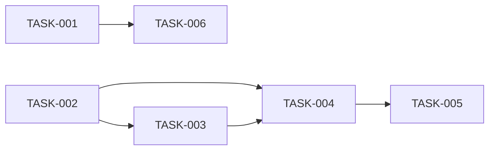

# 08 — Planlama: draw-straws

- Tarih: 2026-07-19 | Mod: AUTOPILOT | Profil: LITE

> LITE: milestone + önceliklendirilmiş backlog.

## Milestone'lar
| M | Hedef | Kapsanan FR'ler | Hedef tarih |
|---|-------|-----------------|-------------|
| M1 | Çalışan, test edilmiş tek-sayfa uygulama + Docker paketi | FR-1..FR-6 | 2026-07-20 |

## Backlog (önceliklendirilmiş, GitHub Issues formatına uyumlu)

### [M1] TASK-001: Proje iskeleti + Express statik sunucu
- **Tahmin:** ≤1 gün
- **Bağımlılık:** —
- **FR:** FR-5
- **Kabul:** `package.json` (tek dep: express), `src/server.js` (`express.static('public')` + `GET /health` → `200 {"status":"ok"}`), güvenlik başlıkları (SEC-4/SEC-7), `health.test.js` yeşil.

### [M1] TASK-002: Fisher-Yates karıştırma + CSPRNG (game.js çekirdek mantık)
- **Tahmin:** ≤1 gün
- **Bağımlılık:** —
- **FR:** FR-2
- **Kabul:** `crypto.getRandomValues` + rejection sampling (SEC-1/SEC-2), `shuffle.test.js`: 1000 simülasyonda her pozisyon 1/N ±%2 (KPI-2).

### [M1] TASK-003: Kurulum ekranı (S1) — oyuncu sayısı girişi + doğrulama
- **Tahmin:** ≤1 gün
- **Bağımlılık:** TASK-002
- **FR:** FR-1, FR-6
- **Kabul:** 2-20 aralık doğrulaması, geçersiz girdide buton disabled + uyarı metni (`docs/06-uiux.md` S1 sözleşmesi).

### [M1] TASK-004: Elden ele çekiliş akışı (S2) — sıralı reveal
- **Tahmin:** ≤1 gün
- **Bağımlılık:** TASK-002, TASK-003
- **FR:** FR-3
- **Kabul:** Yalnız sıradaki çöp tıklanabilir, idempotent tekrar-tık, sıra göstergesi (S2 sözleşmesi).

### [M1] TASK-005: Sonuç ekranı (S3) — vurgu + aria-live + Yeniden Çek
- **Tahmin:** ≤1 gün
- **Bağımlılık:** TASK-004
- **FR:** FR-4
- **Kabul:** ≤1sn görsel vurgu, `aria-live` duyurusu, "Yeniden Çek" yeni bağımsız karıştırma başlatır (S3 sözleşmesi).

### [M1] TASK-006: Dockerfile + npm audit CI kapısı
- **Tahmin:** ≤1 gün
- **Bağımlılık:** TASK-001
- **FR:** FR-5
- **Kabul:** `node:alpine`, `npm ci --omit=dev`, imaj ≤150MB, build ≤15dk (NFR-7); `npm audit` Critical/High=0 (SEC-8).

## Bağımlılık grafı (kalite kapısı: çevrimsiz)

## Kalite kapısı raporu
- "Her task 1 günden küçük" → ✅ GEÇTİ — TASK-001..006 hepsi ≤1 gün tahminli.
- "Bağımlılık grafı çevrimsiz" → ✅ GEÇTİ — yukarıdaki graf DAG'dır, döngü yok.
